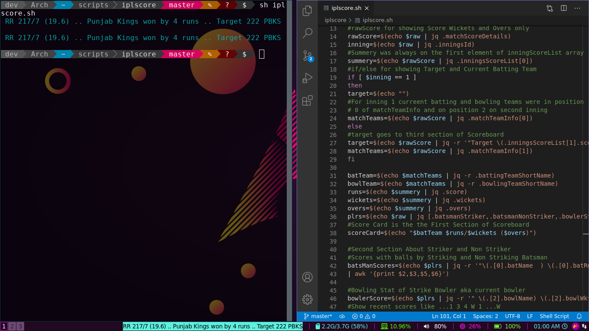
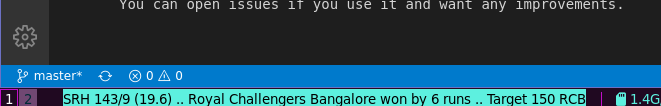
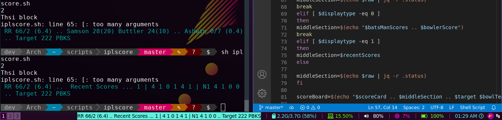
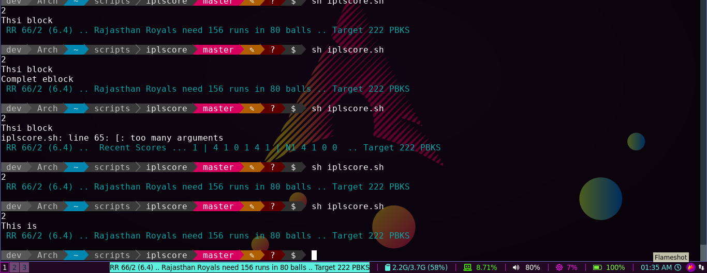

# Ipl Live Score on Bash And I3blocks
It is intended for any terminal running bash or sh. Watch live IPL Scores live on the terminal and it will be sugar on the butter if you use i3wm and i3blocks. Because I have configured it to be compatible to i3blocks.. You can use it any way you can by just few lines of code.
<br><br>
It shows the latest match as menu and you need to select a match to see watch it. You need to install rofi for this.

<br>

## Installation And Use
### Package Dependencies
> 1. jq <br>
> 2. pup <br>
> 3. rofi<br>

Install these three dependencies first.
On arch you can do:
```
yay -S jq pup rofi
```
If you are on debian system, please follow installation methods respectively

You can clone this repository and add path variable to this folder
```
git clone https://github.com/basu-dev/ipl-livescores-bash.git

export PATH="$PATH:{pwd}/ipl-livescores-bash"
```
Append the PATH to .bashrc.
<br>
If you don't know how to do it you can google it.
<br>
### Execute following command and you can start to watch the match.
```
ipl.sh

```

## Some Glances

Sample 1
<br>
Sample 2
<br>
Sample 3
<br>
Sample 4
<br>
Sample 5



## Your Suggestions
You can give your suggestions and feedbacks from any social platforms. You can open issues if you use it and want any improvements.