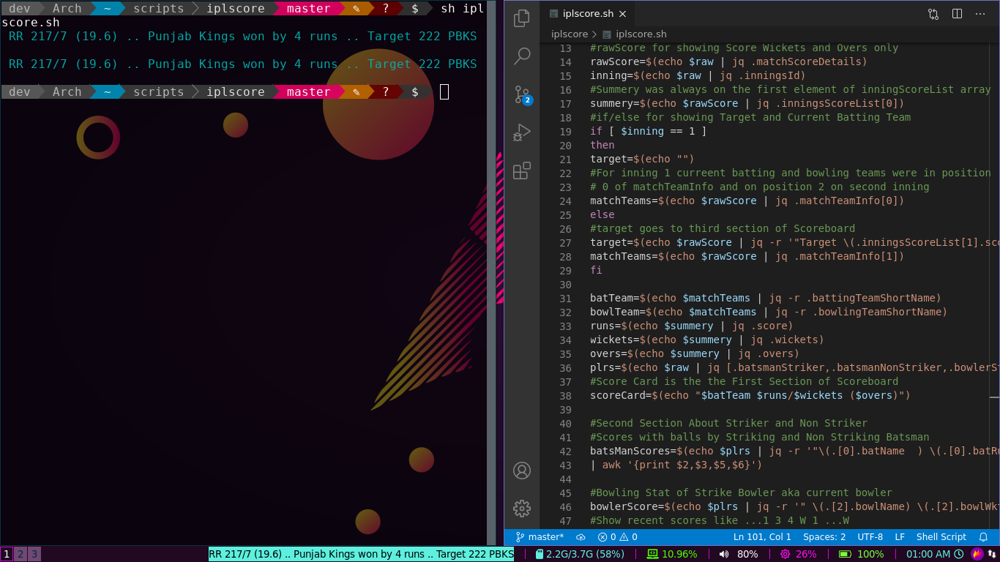
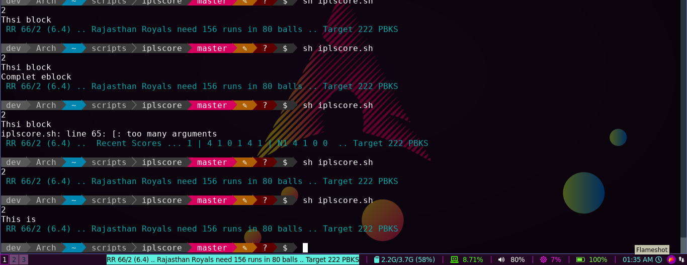
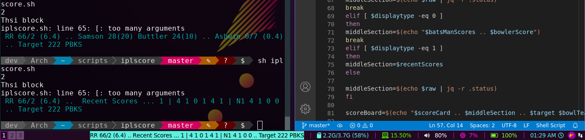
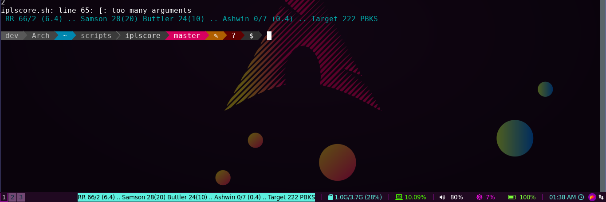

# Ipl Live Score on Bash And I3blocks
It is intended for any terminal running bash or sh. Watch live IPL Scores live on the terminal and it will be sugar on the butter if you use i3wm and i3blocks. Because I have configured it to be compatible to i3blocks.. You can use it any way you can by just few lines of code.
<br><br>
Its not quite usable for all as I need to find the matchId myself . If you can find it from cricbuzz.com you can use it.
<br>
<br>
I will try to find a way around in near future.
## Installation And Use
You can clone this repository and add path variable to this folder
```
export PATH=$PATH:/{pwd}/ipl-livescores-bash
```
And you can use it like
```
>iplscore.sh 55365

"where 55355  is the id of the live match"
"You need to inspect cricbuzz.com and get it for   right now"
```

## Further Improvements
I will try to add the latest ipl match id by itself without going to code and editing it . 
## Some Glances
Sample 1
<br>
Sample 2

Sample 3

Sample 4
